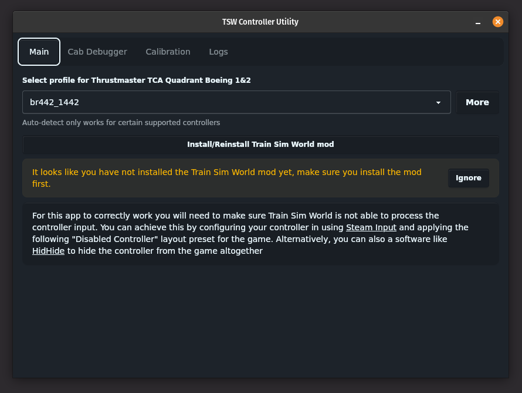
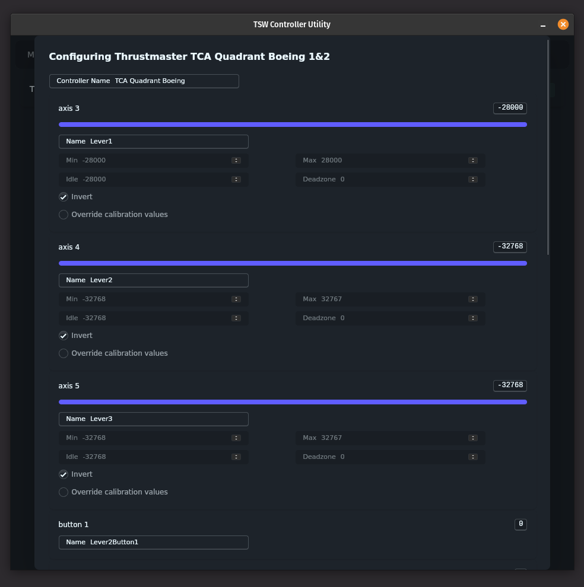
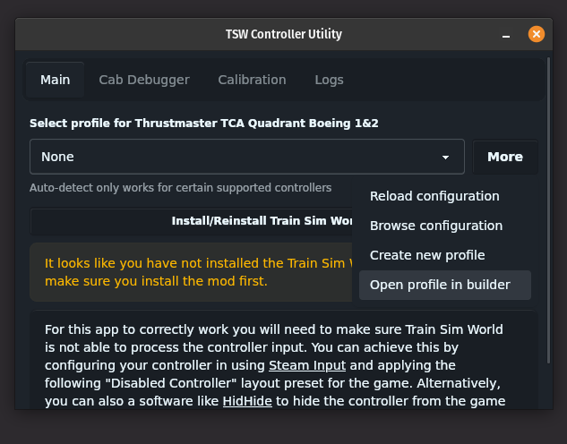
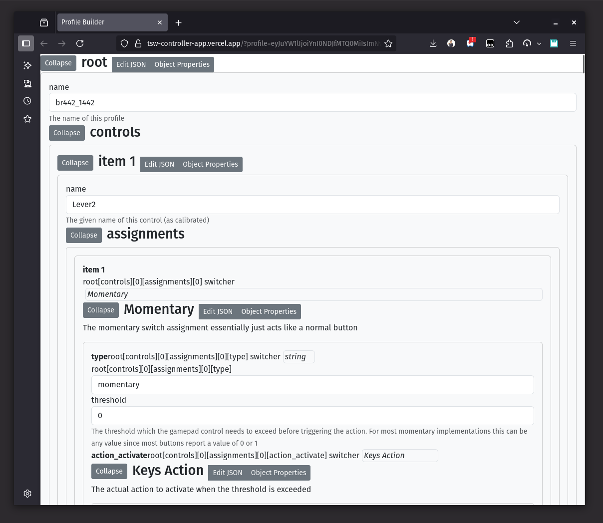

# TSW Controller App

This UE4SS mod and program allow you to use any joystick to directly control the Train Sim World (5/6) game. This is NOT a raildriver compatibility layer, rather it uses UE4SS to directly send input values to the train in game.

## Feature Highlights
### Controller Specific Profile Selection
You can select a profile for each controller allowing for a complex multi controller set-up with different active profiles.  
  

### Cab Debugger
The cab debugger gives a real time status of the current in-game locomotive as the in game controls are changing. This is useful for configuring new train profiles and checking the relevant values.  
  

### Visual Calibration
The new 1.0.0 version also brings a completely overhauled visual calibration mode making it easier than ever to calibrate and configure existing or new controllers  
  

### Profile Builder
A graphical profile builder is now available online to help with configuring new profiles if you are not comfortable creating the JSON profiles  
  
  

You can find some demos below:

- [Acela Demo](https://f001.backblazeb2.com/file/tsw-controller-app-demos/acela-demo.mp4)
- [Birmingham Cross-City Demo](https://f001.backblazeb2.com/file/tsw-controller-app-demos/birmingham-cross-city.mp4)
- [Class 101 Demo](https://f001.backblazeb2.com/file/tsw-controller-app-demos/class101.mp4)
- [LIRR Demo](https://f001.backblazeb2.com/file/tsw-controller-app-demos/lirr.mp4)

## Installation
To install the mod and program just head to the [releases page](https://github.com/LiamMartens/tsw-controller-app/releases) and download the latest release for your platform.  
Windows users will be able to use the installer. Linux and MacOS users can download the respective app for the release.

**Note for macOS and linux**  
SDL2 is required for this app to work and will need to be installed.  
  
On Ubuntu/Debian you can install it using apt  
```
sudo apt install -y  libsdl2-2.0-0
```
  
On macOS you can use [Homebrew](https://brew.sh/) to install SDL2
```
brew install sdl2
```


## Contributing

If you feel like contributing I will happily accept contributions! Some useful contributions would be

- Train configuration improvements.
- Controller SDL mappings and calibrations
- New loco configs

## Links
[Setup Guide](./beta.package/README.md)  
[Profile Configuration Explainer](./beta.package/PROFILE_EXPLAINER.md)  
[Profile Builder](https://tsw-controller-app.vercel.app/)  
[Profile Examples](./examples)  
[Forum Discussion](https://forums.dovetailgames.com/threads/i-created-a-mod-software-to-directly-control-in-game-trains-using-a-joystick-no-raildriver.90609/#post-999423)  
[Reddit Discussion](https://www.reddit.com/r/trainsimworld/comments/1jqt103/i_created_a_modsoftware_to_directly_control_in/)  
[TrainSimCommunity Post](https://www.trainsimcommunity.com/mods/c3-train-sim-world/c75-utilities/i6396-custom-controller-mapper-control-train-sim-world-with-any-joystick-or-analog-controller-no-rail-driver-required)  
